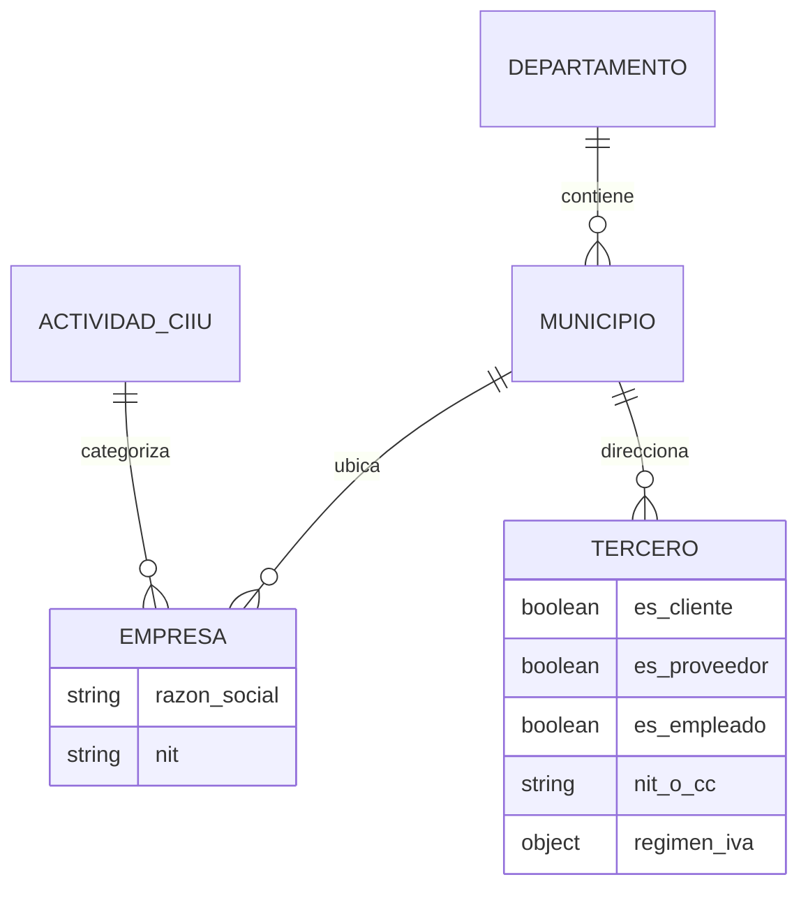

# Documentación Técnica: Módulos Core y Terceros

## 1. Descripción
Estos módulos representan el cimiento base de toda la arquitectura del ERP. El módulo `core` contiene la parametrización maestra de la empresa operativa, la geografía nacional dictada por la DANE, y el catálogo CIIU. El módulo `terceros` centraliza las relaciones humanas y comerciales.

## 2. Modelos y Funciones
### Aplicación `core`
* **Departamento / Municipio:** Almacenan la topología geográfica colombiana para impuestos y despachos. (Llave única DANE).
* **ActividadCIIU:** Clasificación de actividades económicas.
* **Empresa:** Concentra la Razón Social y régimen del operador del ERP. Funciona como constante global.

### Aplicación `terceros`
* **Tercero:** Es el pivote comercial. Incluye identificadores (`es_cliente`, `es_proveedor`, `es_empleado`). Contiene lógicas y reglas de negocio para requerimientos DIAN y estado de validación vía API Muisca.

## 3. Diagrama de Relación y Arquitectura

## 4. Interacción con otros módulos
Cualquier módulo futuro (Compras, Ventas, Nómina) obligatoriamente instanciará una "Foreign Key" protegiendo la relación hacia **Tercero** usando `on_delete=models.PROTECT`.
