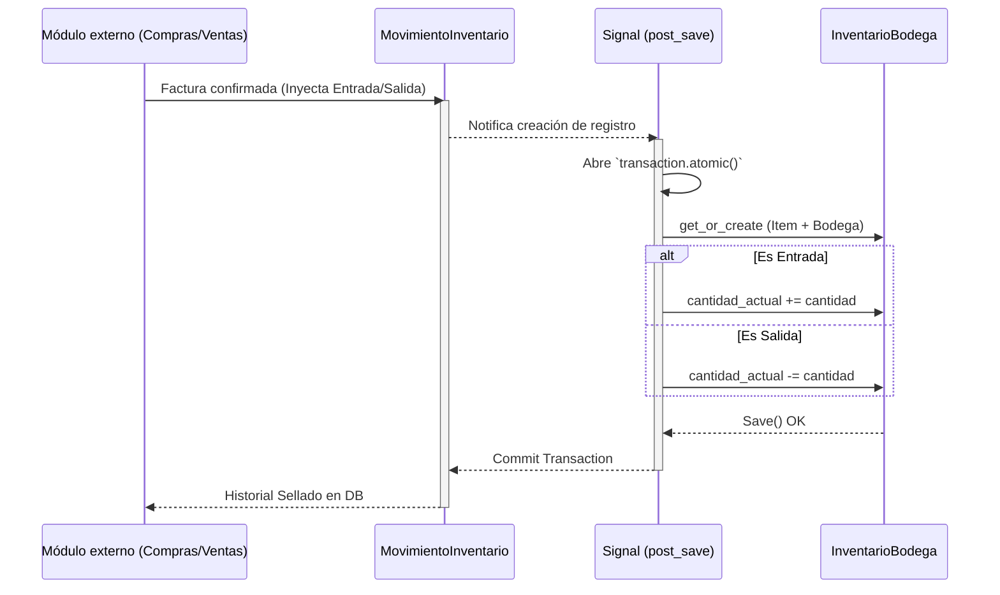

# Documentación Técnica: Inventario y Kardex Inmutable

## 1. Descripción
El módulo `inventario` es el motor lógico del ERP. Garantiza que todas las transacciones físicas de materia prima y producto terminado (Entradas, Salidas, Traslados y Ajustes) se registren impecablemente para asegurar un cumplimiento estricto bajo NIIF. 

## 2. Modelos y Filosofía Funcional
* **Item:** El núcleo. Puede ser 'Almacenable', 'Consumible', 'Servicio' o 'Retal'. Obligatoriamente está atado a una Categoría y a una UnidadBase.
* **ConversionUnidad:** Permite transformar métricas de compra (Toneladas de acero a Kilogramos). Su factor dinámico previene la creación de códigos duplicados.
* **Bodega:** Entidad espacial.
* **InventarioBodega:** Relación de cruce (Stock consolidado real). Es manipulado de forma atómica.
* **MovimientoInventario (Kardex):** Tabla **inmutable** en Django Admin (`readonly`). Es la auditoría pura. Nadie puede alterar la historia manualmente.

## 3. Disparadores Automáticos (Signals)
Mediante `signals.py`, interceptamos cada transacción de `MovimientoInventario`. Si se registra:
* Una **Entrada**: Busca la `Bodega` destino y *SUMA* al `InventarioBodega`.
* Una **Salida**: Busca la `Bodega` origen y *RESTA*.
* Un **Traslado**: Dispara ambas operaciones simultáneamente dentro de un bloque `transaction.atomic()` de Postgres. Si hay un micro-error eléctrico o de red, **TODA LA TRANSACCIÓN SE REVIERTE** para evitar descuadres.

## 4. Diagrama del Data Flow: Signals y Kardex

