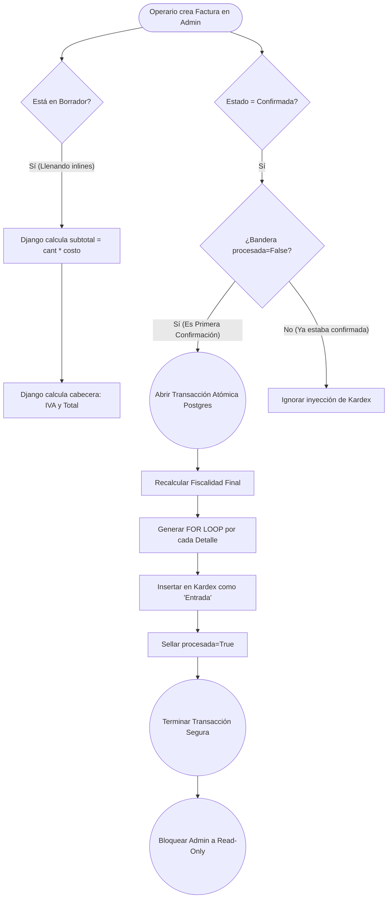

# Documentación Técnica: Abastecimiento y Compras

## 1. Descripción
El módulo `compras` gestiona las inyecciones comerciales hacia el inventario físico. Su diseño previene el factor de error humano en la digitación numérica y estandariza las compras realizadas a proveedores autorizados.

## 2. Modelos y Configuración
* **FacturaCompra:** Entidad CABECERA. Filtra la F.K. hacia `Tercero` exigiendo obligatoriamente el rol `es_proveedor=True`. Posee un estado crítico de bloqueo `Confirmada`, resguardado por validaciones en el Admin (`has_add/change/delete_permission = False` en inlines).
* **DetalleCompra:** Los INLINES vinculados. El campo `subtotal` es no-editable en el formulario. Su cálculo es matemáticamente forzado en el método `save()`.

## 3. Ciclo Transaccional y Autocálculo (El 'save_related' trigger)
Al interceptar el guardado relacionado de la cabecera en el modelo del Admin (`FacturaCompraAdmin`), ejecutamos tres bloques atómicos:
1. **Fiscalidad:** Suma la base de cada detalle inyectado. Calcula el 19% rígido para los `impuestos` y sella el `total`.
2. **Kardex:** Si (y solo si) el usuario presiona que el Estado es "Confirmada", dispara los ítems hacia la tabla Inmutable conectándose con el módulo `Inventario`.
3. **Sello Biométrico:** Eleva una bandera interna (`procesada=True`) que prohíbe mediante IFs que futuras llamadas a la función por error inyecten el Kardex dos veces.

## 4. Diagrama del Algoritmo (Confirmación de Compra)

