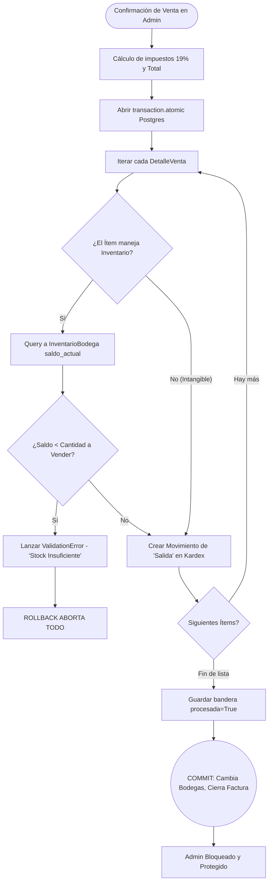

# Documentación Técnica: Ventas y Facturación

## 1. Descripción
El submódulo de final de cadena `ventas` extrae la materialización del Kardex y registra la cuenta comercial. Su eje principal es la validación estricta; a diferencia de muchos sistemas convencionales, prohíbe la facturación de entes abstractos sin saldo en el almacén (Prevención de Negativos NIIF).

## 2. Modelos
* **FacturaVenta:** Filtra lógicamente sus selectores apuntando a `es_cliente=True` en la tabla de `Tercero`.
* **DetalleVenta:** Desagrega el ítem a sustraer e indica explícitamente desde qué `Bodega_Origen` en específico debe despacharse la mercancía.

## 3. Seguridad de Stock: "ValidationError"
En la sobreescritura del método administrativo `save_related`, antes de generar el registro contable y la salida de almacén, el sistema sondea la tabla central `InventarioBodega`:
* Si el flag del ítem dicta `maneja_inventario=True` (Evitando frenar servicios intangibles).
* Interroga: `¿Cantidad a Vender > Cantidad Disponible en Bodega?`.
* Respuesta Afirmativa: Django lanza instantáneamente un `ValidationError`. La base de datos aborta toda la operación y notifica en rojo la diferencia exacta en pantalla. (Protección "First-Line" de Inventario).

## 4. Diagrama: Regla de Oro Anti-Quiebre de Stock

